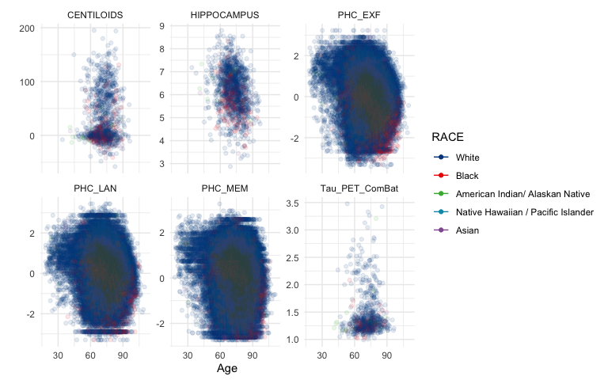
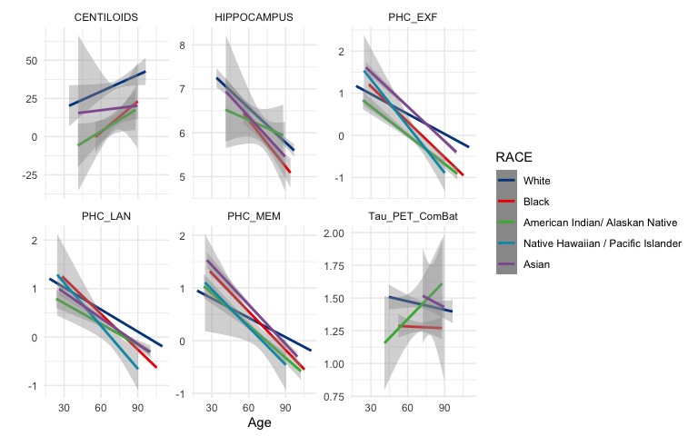
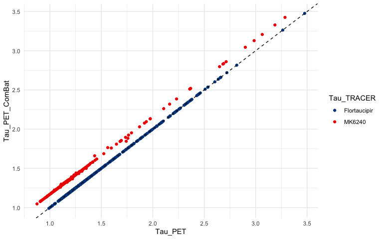

<!-- README.md is generated from README.Rmd. Please edit that file -->

<!-- R package version convention: first two digits are for code; last digit is data release number  -->

# CLARiTI <a href="https://naccdata.org/nacc-collaborations/clariti"></a>

## Overview

`CLARiTI` is an R package containing data and code for the **Consortium
for Clarity in ADRD Research Through Imaging (CLARiTI)** (Mormino et al.
2025). `CLARiTI` is a bundle of data, analysis code examples, and html
and pdf documentation. Documentation can be found at
<https://atri-biostats.github.io/CLARiTI>

## Installation

To install `CLARiTI`:

- In R, run
  `install.packages("path/to/CLARiTI_0.1.0.1.tar.gz", repos = NULL, type = "source")`

The script to build this R package can be found in
[tools](https://github.com/atri-biostats/CLARiTI/tree/main/tools).

The code below demonstrates how to use data in the `CLARiTI` package and
R Core Team (2024) to derive some basic summaries.

# Organize data

``` r
# For hippocampus volume from SCAN
dd <- investigator_scan_mrisbm_nacc66 %>%
  select(NACCID, DATE = SCANDT, HIPPOCAMPUS, ICV = CEREBRUMTCV) %>%
  full_join(investigator_scan_taupetnpdka_nacc66 %>%
    select(NACCID, DATE = SCANDATE, Tau_PET = META_TEMPORAL_SUVR, TRACER) %>%
    mutate(TRACER = case_when(
      TRACER == 1 ~ 'FDG',
      TRACER == 2 ~ 'PIB',
      TRACER == 3 ~ 'Florbetapir',
      TRACER == 4 ~ 'Florbetaben',
      TRACER == 5 ~ 'NAV4694',
      TRACER == 6 ~ 'Flortaucipir',
      TRACER == 7 ~ 'MK6240',
      TRACER == 8 ~ 'PI2620',
      TRACER == 9 ~ 'GTP1',
      TRACER == 99 ~ 'Unknown') %>% as.factor()) %>%
    rename(Tau_TRACER = TRACER),
    by = c('NACCID', 'DATE')) %>%
  full_join(investigator_scan_amyloidpetgaain_nacc66 %>%
    select(NACCID, DATE = SCANDATE, AMYLOID_STATUS, CENTILOIDS, TRACER) %>%
    mutate(TRACER = case_when(
      TRACER == 1 ~ 'FDG',
      TRACER == 2 ~ 'PIB',
      TRACER == 3 ~ 'Florbetapir',
      TRACER == 4 ~ 'Florbetaben',
      TRACER == 5 ~ 'NAV4694',
      TRACER == 6 ~ 'Flortaucipir',
      TRACER == 7 ~ 'MK6240',
      TRACER == 8 ~ 'PI2620',
      TRACER == 9 ~ 'GTP1',
      TRACER == 99 ~ 'Unknown') %>% as.factor()) %>%
    rename(Amyloid_TRACER = TRACER),
    by = c('NACCID', 'DATE')) %>%
  full_join(NACC_ADSP_PHC_Cognition_2024 %>%
    select(NACCID, NACCVNUM, PHC_MEM, PHC_EXF, PHC_LAN) %>%
    left_join(investigator_ftldlbd_nacc66 %>%
      mutate(DATE = as.Date(paste(VISITYR, VISITMO, VISITDAY, sep='-'))) %>%
      select(NACCID, NACCVNUM, DATE),
      by = c('NACCID', 'NACCVNUM')),
    by = c('NACCID', 'DATE')) %>%
  left_join(investigator_ftldlbd_nacc66 %>%
    mutate(BIRTHDATE = as.Date(paste(BIRTHYR, BIRTHMO, 15, sep = '-'))) %>%
    filter(!is.na(BIRTHDATE)) %>%
    arrange(NACCID, NACCVNUM) %>%
    select(NACCID, BIRTHDATE, RACE, SEX, EDUC, HISPANIC) %>%
    group_by(NACCID) %>%
    fill(.direction = "updown") %>%
    ungroup() %>%
    filter(!duplicated(NACCID)),
    by = 'NACCID') %>%
  mutate(Age = as.numeric(DATE - BIRTHDATE)/365.25) %>%
  group_by(NACCID) %>%
  mutate(ICV = mean(ICV, na.rm = TRUE)) %>%
  ungroup() %>%
  arrange(NACCID, DATE)

dd_cross <- dd %>%
  group_by(NACCID) %>%
  fill(everything(), .direction = "updown") %>%
  filter(!duplicated(NACCID)) %>%
  mutate(
    SEX = case_when(is.na(SEX) ~ " Missing", TRUE ~ SEX) %>%
      factor(levels = c(" Male", "Female", " Missing"))
  ) %>%
  ungroup()

# harmonize tau PET data ----
tmp <- dd %>% filter(!is.na(Tau_PET) & !is.na(Age))
tau_PET_fit <- lme(Tau_PET ~ Tau_TRACER + SEX + Age, data = tmp,
  random = ~ 1 | NACCID,
  weights = varIdent(form = ~ 1 | Tau_TRACER))
tmp$Tau_PET_ComBat <- ComBat(Tau_PET ~ Tau_TRACER + SEX + Age, data = tmp,
  random1 = ~ 1 | NACCID, random2 = NULL,
  weights = varIdent(form = ~ 1 | Tau_TRACER))

dd <- dd %>%
  left_join(tmp %>% select(NACCID, DATE, Tau_PET_ComBat), 
    by = c('NACCID', 'DATE'))
```

# Baseline characteristics tables

``` r
mylabels = list(
  PHC_MEM = 'Harmonized Memory', 
  PHC_EXF = 'Harmonized Exec Function', 
  PHC_LAN = 'Harmonized Language',
  EDUC = 'Education (yrs)',
  Age = 'Age (yrs)')
```

## All CLARiTI participants

``` r
tableby(SEX ~ Age + RACE + HISPANIC + 
    AMYLOID_STATUS + CENTILOIDS +
    HIPPOCAMPUS + Tau_PET + Tau_TRACER +
    PHC_MEM + PHC_EXF + PHC_LAN + EDUC, 
  data = dd_cross %>% filter(SEX != ' Missing')) %>%
  summary(labelTranslations = mylabels, digits = 1)
```

|  | Male (N=21115) | Female (N=28294) | Total (N=49409) | p value |
|:---|:--:|:--:|:--:|---:|
| **Age (yrs)** |  |  |  | \< 0.001 |
|    Mean (SD) | 71.8 (10.3) | 71.5 (10.4) | 71.6 (10.4) |  |
|    Range | 19.7 - 104.1 | 18.0 - 109.9 | 18.0 - 109.9 |  |
| **RACE** |  |  |  |  |
|    N-Miss | 412 | 782 | 1194 |  |
|    White | 17977 (86.8%) | 21229 (77.2%) | 39206 (81.3%) |  |
|    Black | 2051 (9.9%) | 5221 (19.0%) | 7272 (15.1%) |  |
|    American Indian/ Alaskan Native | 158 (0.8%) | 298 (1.1%) | 456 (0.9%) |  |
|    Native Hawaiian / Pacific Islander | 21 (0.1%) | 33 (0.1%) | 54 (0.1%) |  |
|    Asian | 496 (2.4%) | 731 (2.7%) | 1227 (2.5%) |  |
|    Multiracial | 0 (0.0%) | 0 (0.0%) | 0 (0.0%) |  |
|    Other | 0 (0.0%) | 0 (0.0%) | 0 (0.0%) |  |
|    Missing/Unknown | 0 (0.0%) | 0 (0.0%) | 0 (0.0%) |  |
| **HISPANIC** |  |  |  |  |
|    No | 19566 (92.7%) | 25308 (89.4%) | 44874 (90.8%) |  |
|    Yes | 1468 (7.0%) | 2869 (10.1%) | 4337 (8.8%) |  |
|    Unknown/Other | 81 (0.4%) | 117 (0.4%) | 198 (0.4%) |  |
|    Missing/Not Assessed/Not Available | 0 (0.0%) | 0 (0.0%) | 0 (0.0%) |  |
| **AMYLOID_STATUS** |  |  |  | 0.015 |
|    N-Miss | 20612 | 27587 | 48199 |  |
|    Mean (SD) | 0.5 (0.5) | 0.4 (0.5) | 0.5 (0.5) |  |
|    Range | 0.0 - 1.0 | 0.0 - 1.0 | 0.0 - 1.0 |  |
| **CENTILOIDS** |  |  |  | \< 0.001 |
|    N-Miss | 20612 | 27587 | 48199 |  |
|    Mean (SD) | 33.9 (46.6) | 25.2 (42.4) | 28.8 (44.3) |  |
|    Range | -48.0 - 195.0 | -58.0 - 194.0 | -58.0 - 195.0 |  |
| **HIPPOCAMPUS** |  |  |  | \< 0.001 |
|    N-Miss | 20509 | 27438 | 47947 |  |
|    Mean (SD) | 6.5 (0.9) | 6.0 (0.8) | 6.2 (0.9) |  |
|    Range | 3.3 - 8.8 | 2.9 - 8.3 | 2.9 - 8.8 |  |
| **Tau_PET** |  |  |  | 0.845 |
|    N-Miss | 20793 | 27857 | 48650 |  |
|    Mean (SD) | 1.4 (0.4) | 1.4 (0.4) | 1.4 (0.4) |  |
|    Range | 0.9 - 3.0 | 0.9 - 3.5 | 0.9 - 3.5 |  |
| **Tau_TRACER** |  |  |  | 0.003 |
|    N-Miss | 20793 | 27857 | 48650 |  |
|    Flortaucipir | 230 (71.4%) | 266 (60.9%) | 496 (65.3%) |  |
|    MK6240 | 92 (28.6%) | 171 (39.1%) | 263 (34.7%) |  |
| **Harmonized Memory** |  |  |  | \< 0.001 |
|    N-Miss | 68 | 110 | 178 |  |
|    Mean (SD) | -0.0 (0.9) | 0.1 (1.0) | 0.1 (0.9) |  |
|    Range | -2.7 - 2.7 | -2.7 - 2.7 | -2.7 - 2.7 |  |
| **Harmonized Exec Function** |  |  |  | \< 0.001 |
|    N-Miss | 467 | 650 | 1117 |  |
|    Mean (SD) | 0.0 (0.9) | 0.1 (0.9) | 0.1 (0.9) |  |
|    Range | -3.3 - 3.2 | -3.3 - 3.2 | -3.3 - 3.2 |  |
| **Harmonized Language** |  |  |  | \< 0.001 |
|    N-Miss | 453 | 637 | 1090 |  |
|    Mean (SD) | 0.1 (0.8) | 0.3 (0.9) | 0.2 (0.9) |  |
|    Range | -2.9 - 3.0 | -3.3 - 3.3 | -3.3 - 3.3 |  |
| **Education (yrs)** |  |  |  | \< 0.001 |
|    Mean (SD) | 16.4 (7.6) | 15.4 (7.6) | 15.8 (7.6) |  |
|    Range | 0.0 - 99.0 | 0.0 - 99.0 | 0.0 - 99.0 |  |

## CLARiTI participants with hippocampal volumes

``` r
tableby(SEX ~ Age + RACE + HISPANIC + 
    AMYLOID_STATUS + CENTILOIDS +
    HIPPOCAMPUS + Tau_PET + Tau_TRACER +
    PHC_MEM + PHC_EXF + PHC_LAN + EDUC, 
  data = dd_cross %>% filter(!is.na(HIPPOCAMPUS) & SEX != ' Missing')) %>%
  summary(labelTranslations = mylabels, digits = 1)
```

|  | Male (N=606) | Female (N=856) | Total (N=1462) | p value |
|:---|:--:|:--:|:--:|---:|
| **Age (yrs)** |  |  |  | 0.020 |
|    Mean (SD) | 69.0 (7.9) | 68.0 (8.2) | 68.4 (8.1) |  |
|    Range | 36.4 - 91.7 | 33.7 - 92.1 | 33.7 - 92.1 |  |
| **RACE** |  |  |  |  |
|    N-Miss | 7 | 12 | 19 |  |
|    White | 537 (89.6%) | 669 (79.3%) | 1206 (83.6%) |  |
|    Black | 46 (7.7%) | 145 (17.2%) | 191 (13.2%) |  |
|    American Indian/ Alaskan Native | 5 (0.8%) | 12 (1.4%) | 17 (1.2%) |  |
|    Native Hawaiian / Pacific Islander | 0 (0.0%) | 0 (0.0%) | 0 (0.0%) |  |
|    Asian | 11 (1.8%) | 18 (2.1%) | 29 (2.0%) |  |
|    Multiracial | 0 (0.0%) | 0 (0.0%) | 0 (0.0%) |  |
|    Other | 0 (0.0%) | 0 (0.0%) | 0 (0.0%) |  |
|    Missing/Unknown | 0 (0.0%) | 0 (0.0%) | 0 (0.0%) |  |
| **HISPANIC** |  |  |  |  |
|    No | 569 (93.9%) | 795 (92.9%) | 1364 (93.3%) |  |
|    Yes | 33 (5.4%) | 55 (6.4%) | 88 (6.0%) |  |
|    Unknown/Other | 4 (0.7%) | 6 (0.7%) | 10 (0.7%) |  |
|    Missing/Not Assessed/Not Available | 0 (0.0%) | 0 (0.0%) | 0 (0.0%) |  |
| **AMYLOID_STATUS** |  |  |  | 0.206 |
|    N-Miss | 363 | 542 | 905 |  |
|    Mean (SD) | 0.5 (0.5) | 0.5 (0.5) | 0.5 (0.5) |  |
|    Range | 0.0 - 1.0 | 0.0 - 1.0 | 0.0 - 1.0 |  |
| **CENTILOIDS** |  |  |  | 0.062 |
|    N-Miss | 363 | 542 | 905 |  |
|    Mean (SD) | 37.7 (46.3) | 30.4 (44.3) | 33.6 (45.3) |  |
|    Range | -17.0 - 153.0 | -34.0 - 194.0 | -34.0 - 194.0 |  |
| **HIPPOCAMPUS** |  |  |  | \< 0.001 |
|    Mean (SD) | 6.5 (0.9) | 6.0 (0.8) | 6.2 (0.9) |  |
|    Range | 3.3 - 8.8 | 2.9 - 8.3 | 2.9 - 8.8 |  |
| **Tau_PET** |  |  |  | 0.794 |
|    N-Miss | 450 | 650 | 1100 |  |
|    Mean (SD) | 1.4 (0.4) | 1.4 (0.4) | 1.4 (0.4) |  |
|    Range | 0.9 - 3.0 | 0.9 - 3.3 | 0.9 - 3.3 |  |
| **Tau_TRACER** |  |  |  | 0.171 |
|    N-Miss | 450 | 650 | 1100 |  |
|    Flortaucipir | 107 (68.6%) | 127 (61.7%) | 234 (64.6%) |  |
|    MK6240 | 49 (31.4%) | 79 (38.3%) | 128 (35.4%) |  |
| **Harmonized Memory** |  |  |  | \< 0.001 |
|    N-Miss | 4 | 3 | 7 |  |
|    Mean (SD) | 0.5 (0.7) | 0.6 (0.8) | 0.6 (0.7) |  |
|    Range | -1.9 - 2.4 | -2.3 - 2.6 | -2.3 - 2.6 |  |
| **Harmonized Exec Function** |  |  |  | 0.758 |
|    N-Miss | 4 | 3 | 7 |  |
|    Mean (SD) | 0.4 (0.8) | 0.5 (0.9) | 0.5 (0.8) |  |
|    Range | -3.0 - 2.7 | -3.3 - 2.9 | -3.3 - 2.9 |  |
| **Harmonized Language** |  |  |  | 0.027 |
|    N-Miss | 4 | 3 | 7 |  |
|    Mean (SD) | 0.6 (0.7) | 0.7 (0.8) | 0.7 (0.7) |  |
|    Range | -2.0 - 2.3 | -2.7 - 3.1 | -2.7 - 3.1 |  |
| **Education (yrs)** |  |  |  | \< 0.001 |
|    Mean (SD) | 16.9 (5.4) | 16.0 (2.7) | 16.4 (4.1) |  |
|    Range | 0.0 - 99.0 | 0.0 - 25.0 | 0.0 - 99.0 |  |

## CLARiTI participants with tau PET

``` r
tableby(SEX ~ Age + RACE + HISPANIC + 
    AMYLOID_STATUS + CENTILOIDS +
    HIPPOCAMPUS + Tau_PET + Tau_TRACER +
    PHC_MEM + PHC_EXF + PHC_LAN + EDUC, 
  data = dd_cross %>% filter(!is.na(Tau_PET) & SEX != ' Missing')) %>%
  summary(labelTranslations = mylabels, digits = 1)
```

|  | Male (N=322) | Female (N=437) | Total (N=759) | p value |
|:---|:--:|:--:|:--:|---:|
| **Age (yrs)** |  |  |  | 0.014 |
|    Mean (SD) | 68.4 (9.1) | 66.7 (8.7) | 67.4 (8.9) |  |
|    Range | 32.5 - 92.2 | 41.1 - 87.6 | 32.5 - 92.2 |  |
| **RACE** |  |  |  |  |
|    N-Miss | 2 | 2 | 4 |  |
|    White | 295 (92.2%) | 353 (81.1%) | 648 (85.8%) |  |
|    Black | 15 (4.7%) | 60 (13.8%) | 75 (9.9%) |  |
|    American Indian/ Alaskan Native | 5 (1.6%) | 18 (4.1%) | 23 (3.0%) |  |
|    Native Hawaiian / Pacific Islander | 1 (0.3%) | 0 (0.0%) | 1 (0.1%) |  |
|    Asian | 4 (1.2%) | 4 (0.9%) | 8 (1.1%) |  |
|    Multiracial | 0 (0.0%) | 0 (0.0%) | 0 (0.0%) |  |
|    Other | 0 (0.0%) | 0 (0.0%) | 0 (0.0%) |  |
|    Missing/Unknown | 0 (0.0%) | 0 (0.0%) | 0 (0.0%) |  |
| **HISPANIC** |  |  |  |  |
|    No | 304 (94.4%) | 408 (93.4%) | 712 (93.8%) |  |
|    Yes | 17 (5.3%) | 26 (5.9%) | 43 (5.7%) |  |
|    Unknown/Other | 1 (0.3%) | 3 (0.7%) | 4 (0.5%) |  |
|    Missing/Not Assessed/Not Available | 0 (0.0%) | 0 (0.0%) | 0 (0.0%) |  |
| **AMYLOID_STATUS** |  |  |  | 0.450 |
|    N-Miss | 50 | 71 | 121 |  |
|    Mean (SD) | 0.5 (0.5) | 0.5 (0.5) | 0.5 (0.5) |  |
|    Range | 0.0 - 1.0 | 0.0 - 1.0 | 0.0 - 1.0 |  |
| **CENTILOIDS** |  |  |  | 0.127 |
|    N-Miss | 50 | 71 | 121 |  |
|    Mean (SD) | 36.8 (46.2) | 31.4 (43.3) | 33.7 (44.6) |  |
|    Range | -35.0 - 195.0 | -58.0 - 172.0 | -58.0 - 195.0 |  |
| **HIPPOCAMPUS** |  |  |  | \< 0.001 |
|    N-Miss | 166 | 231 | 397 |  |
|    Mean (SD) | 6.3 (1.0) | 6.0 (0.8) | 6.1 (0.9) |  |
|    Range | 3.3 - 8.5 | 3.4 - 8.3 | 3.3 - 8.5 |  |
| **Tau_PET** |  |  |  | 0.845 |
|    Mean (SD) | 1.4 (0.4) | 1.4 (0.4) | 1.4 (0.4) |  |
|    Range | 0.9 - 3.0 | 0.9 - 3.5 | 0.9 - 3.5 |  |
| **Tau_TRACER** |  |  |  | 0.003 |
|    Flortaucipir | 230 (71.4%) | 266 (60.9%) | 496 (65.3%) |  |
|    MK6240 | 92 (28.6%) | 171 (39.1%) | 263 (34.7%) |  |
| **Harmonized Memory** |  |  |  | 0.002 |
|    N-Miss | 6 | 6 | 12 |  |
|    Mean (SD) | 0.4 (0.7) | 0.6 (0.8) | 0.5 (0.7) |  |
|    Range | -1.4 - 2.2 | -2.6 - 2.6 | -2.6 - 2.6 |  |
| **Harmonized Exec Function** |  |  |  | 0.852 |
|    N-Miss | 5 | 5 | 10 |  |
|    Mean (SD) | 0.4 (0.8) | 0.4 (0.9) | 0.4 (0.8) |  |
|    Range | -2.6 - 2.7 | -3.2 - 2.7 | -3.2 - 2.7 |  |
| **Harmonized Language** |  |  |  | 0.029 |
|    N-Miss | 5 | 5 | 10 |  |
|    Mean (SD) | 0.5 (0.7) | 0.6 (0.8) | 0.6 (0.7) |  |
|    Range | -1.8 - 2.5 | -2.3 - 2.9 | -2.3 - 2.9 |  |
| **Education (yrs)** |  |  |  | \< 0.001 |
|    Mean (SD) | 16.7 (2.5) | 16.0 (2.5) | 16.3 (2.5) |  |
|    Range | 8.0 - 20.0 | 8.0 - 21.0 | 8.0 - 21.0 |  |

## CLARiTI participants with amyloid PET

``` r
tableby(SEX ~ Age + RACE + HISPANIC + 
    AMYLOID_STATUS + CENTILOIDS +
    HIPPOCAMPUS + Tau_PET + Tau_TRACER +
    PHC_MEM + PHC_EXF + PHC_LAN + EDUC, 
  data = dd_cross %>% filter(!is.na(CENTILOIDS) & SEX != ' Missing')) %>%
  summary(labelTranslations = mylabels, digits = 1)
```

|  | Male (N=503) | Female (N=707) | Total (N=1210) | p value |
|:---|:--:|:--:|:--:|---:|
| **Age (yrs)** |  |  |  | 0.002 |
|    Mean (SD) | 69.2 (8.2) | 67.7 (8.2) | 68.3 (8.2) |  |
|    Range | 33.9 - 92.2 | 41.1 - 92.1 | 33.9 - 92.2 |  |
| **RACE** |  |  |  |  |
|    N-Miss | 4 | 5 | 9 |  |
|    White | 437 (87.6%) | 530 (75.5%) | 967 (80.5%) |  |
|    Black | 43 (8.6%) | 130 (18.5%) | 173 (14.4%) |  |
|    American Indian/ Alaskan Native | 6 (1.2%) | 18 (2.6%) | 24 (2.0%) |  |
|    Native Hawaiian / Pacific Islander | 1 (0.2%) | 0 (0.0%) | 1 (0.1%) |  |
|    Asian | 12 (2.4%) | 24 (3.4%) | 36 (3.0%) |  |
|    Multiracial | 0 (0.0%) | 0 (0.0%) | 0 (0.0%) |  |
|    Other | 0 (0.0%) | 0 (0.0%) | 0 (0.0%) |  |
|    Missing/Unknown | 0 (0.0%) | 0 (0.0%) | 0 (0.0%) |  |
| **HISPANIC** |  |  |  |  |
|    No | 470 (93.4%) | 659 (93.2%) | 1129 (93.3%) |  |
|    Yes | 29 (5.8%) | 44 (6.2%) | 73 (6.0%) |  |
|    Unknown/Other | 4 (0.8%) | 4 (0.6%) | 8 (0.7%) |  |
|    Missing/Not Assessed/Not Available | 0 (0.0%) | 0 (0.0%) | 0 (0.0%) |  |
| **AMYLOID_STATUS** |  |  |  | 0.015 |
|    Mean (SD) | 0.5 (0.5) | 0.4 (0.5) | 0.5 (0.5) |  |
|    Range | 0.0 - 1.0 | 0.0 - 1.0 | 0.0 - 1.0 |  |
| **CENTILOIDS** |  |  |  | \< 0.001 |
|    Mean (SD) | 33.9 (46.6) | 25.2 (42.4) | 28.8 (44.3) |  |
|    Range | -48.0 - 195.0 | -58.0 - 194.0 | -58.0 - 195.0 |  |
| **HIPPOCAMPUS** |  |  |  | \< 0.001 |
|    N-Miss | 260 | 393 | 653 |  |
|    Mean (SD) | 6.4 (1.0) | 6.0 (0.8) | 6.1 (0.9) |  |
|    Range | 3.3 - 8.5 | 3.4 - 8.3 | 3.3 - 8.5 |  |
| **Tau_PET** |  |  |  | 0.920 |
|    N-Miss | 231 | 341 | 572 |  |
|    Mean (SD) | 1.4 (0.4) | 1.4 (0.4) | 1.4 (0.4) |  |
|    Range | 0.9 - 3.0 | 0.9 - 3.5 | 0.9 - 3.5 |  |
| **Tau_TRACER** |  |  |  | 0.013 |
|    N-Miss | 231 | 341 | 572 |  |
|    Flortaucipir | 188 (69.1%) | 218 (59.6%) | 406 (63.6%) |  |
|    MK6240 | 84 (30.9%) | 148 (40.4%) | 232 (36.4%) |  |
| **Harmonized Memory** |  |  |  | \< 0.001 |
|    N-Miss | 8 | 7 | 15 |  |
|    Mean (SD) | 0.4 (0.7) | 0.6 (0.8) | 0.5 (0.7) |  |
|    Range | -1.9 - 2.3 | -2.6 - 2.6 | -2.6 - 2.6 |  |
| **Harmonized Exec Function** |  |  |  | 0.072 |
|    N-Miss | 7 | 6 | 13 |  |
|    Mean (SD) | 0.4 (0.9) | 0.5 (0.8) | 0.4 (0.8) |  |
|    Range | -2.6 - 2.9 | -3.2 - 2.7 | -3.2 - 2.9 |  |
| **Harmonized Language** |  |  |  | \< 0.001 |
|    N-Miss | 7 | 6 | 13 |  |
|    Mean (SD) | 0.5 (0.7) | 0.7 (0.8) | 0.6 (0.7) |  |
|    Range | -1.9 - 2.9 | -2.3 - 2.9 | -2.3 - 2.9 |  |
| **Education (yrs)** |  |  |  | \< 0.001 |
|    Mean (SD) | 17.0 (4.4) | 16.1 (2.5) | 16.5 (3.5) |  |
|    Range | 8.0 - 99.0 | 4.0 - 21.0 | 4.0 - 99.0 |  |

# Summary plots

``` r
dd %>% 
  select(NACCID, Age, RACE, HIPPOCAMPUS, Tau_PET_ComBat, CENTILOIDS,
    PHC_MEM, PHC_EXF, PHC_LAN) %>%
  pivot_longer(HIPPOCAMPUS:PHC_LAN) %>%
  filter(!is.na(value) & !is.na(RACE)) %>%
ggplot(aes(x=Age, y=value, color=RACE)) +
  geom_point(alpha=0.1) +
  geom_line(aes(group = NACCID), alpha=0.01) +
  facet_wrap(vars(name), scales = 'free_y') +
  guides(colour = guide_legend(override.aes = list(alpha=1))) +
  ylab('')
```

<div class="figure">


<p class="caption">

Spaghetti of selected outcomes by age and race
</p>

</div>

``` r
dd %>% 
  select(NACCID, Age, RACE, HIPPOCAMPUS, Tau_PET_ComBat, CENTILOIDS,
    PHC_MEM, PHC_EXF, PHC_LAN) %>%
  pivot_longer(HIPPOCAMPUS:PHC_LAN) %>%
  filter(!is.na(value) & !is.na(RACE)) %>%
ggplot(aes(x=Age, y=value, color=RACE)) +
  geom_smooth(method = 'lm') +
  # geom_smooth(method = 'gam', formula = y ~ s(x, bs = "cs", fx = TRUE, k = 1)) +
  facet_wrap(vars(name), scales = 'free_y') +
  guides(colour = guide_legend(override.aes = list(alpha=1))) +
  ylab('')
#> `geom_smooth()` using formula = 'y ~ x'
```

<div class="figure">


<p class="caption">

Locally weighted scatterplot smooths (LOWESS) of selected outcomes by
age and race
</p>

</div>

# ComBat Harmonization of tau PET (tracers)

``` r
summary(tau_PET_fit)
#> Linear mixed-effects model fit by REML
#>   Data: tmp 
#>   AIC BIC logLik
#>   617 649   -301
#> 
#> Random effects:
#>  Formula: ~1 | NACCID
#>         (Intercept) Residual
#> StdDev:        0.38    0.043
#> 
#> Variance function:
#>  Structure: Different standard deviations per stratum
#>  Formula: ~1 | Tau_TRACER 
#>  Parameter estimates:
#> Flortaucipir       MK6240 
#>          1.0          1.7 
#> Fixed effects:  Tau_PET ~ Tau_TRACER + SEX + Age 
#>                  Value Std.Error  DF t-value p-value
#> (Intercept)       1.39     0.114 757    12.2    0.00
#> Tau_TRACERMK6240 -0.17     0.028  52    -5.9    0.00
#> SEXFemale         0.02     0.029 757     0.8    0.42
#> Age               0.00     0.002  52     0.3    0.79
#>  Correlation: 
#>                  (Intr) T_TRAC SEXFml
#> Tau_TRACERMK6240 -0.157              
#> SEXFemale        -0.185 -0.099       
#> Age              -0.979  0.090  0.051
#> 
#> Standardized Within-Group Residuals:
#>    Min     Q1    Med     Q3    Max 
#> -2.150 -0.077 -0.047  0.022  2.350 
#> 
#> Number of Observations: 813
#> Number of Groups: 759
ggplot(dd %>% filter(!is.na(Tau_PET_ComBat)), 
  aes(x = Tau_PET, y = Tau_PET_ComBat, color = Tau_TRACER)) +
  geom_point() +
  geom_abline(intercept = 0, slope = 1, linetype = 'dashed')
```



## References

<div id="refs" class="references csl-bib-body hanging-indent"
entry-spacing="0">

<div id="ref-mormino2025consortium" class="csl-entry">

Mormino, Elizabeth C, Sarah A Biber, Annalise Rahman-Filipiak,
Konstantinos Arfanakis, Lindsay Clark, Jeffrey L Dage, John A Detre, et
al. 2025. “The Consortium for Clarity in ADRD Research Through Imaging
(CLARiTI).” *Alzheimer’s & Dementia* 21 (1): e14383.

</div>

<div id="ref-R" class="csl-entry">

R Core Team. 2024. *R: A Language and Environment for Statistical
Computing*. Vienna, Austria: R Foundation for Statistical Computing.
<https://www.R-project.org/>.

</div>

</div>
